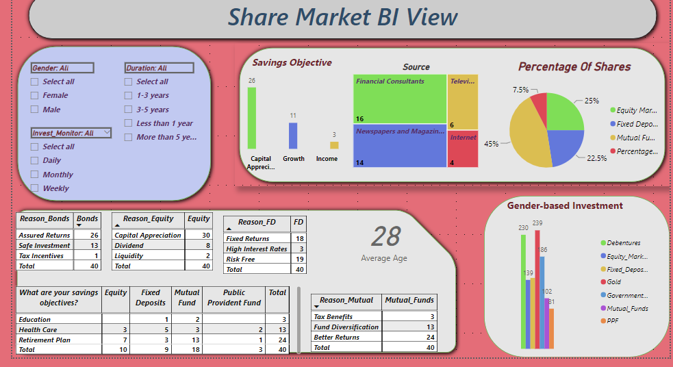

# Stock Market Investment Analysis Dashboard

## Overview
This project is a comprehensive analysis of investment preferences based on gender and various other factors. The insights are visualized using Power BI to assist in data-driven decision-making for the stock market.

---

## Key Features
- **Gender-Based Analysis**: Visualized differences in investment preferences, including equity, mutual funds, and fixed deposits.
- **Savings Objectives**: Insights into savings goals such as capital appreciation, growth, and income.
- **Monitoring Frequencies**: Examined how frequently investments are monitored (daily, weekly, monthly).
- **Investment Reasons**: Reasons like tax benefits, fund diversification, and risk-free options.
- **Sources of Investment Information**: Newspapers, financial consultants, television, and the internet.

---

## Visualizations
1. **Pie Chart**: Share percentage of investment in Equity, Fixed Deposits, Mutual Funds, PPF, etc.
2. **Treemap**: Popularity of information sources like financial consultants and media.
3. **Column Chart**: Gender-wise investment distribution across various avenues (e.g., equity, gold).
4. **Slicer**: Filters for gender, investment duration, and monitoring frequency.
5. **Matrix Table**: Average age and reasons for specific investment avenues.

---

## Dataset
The dataset includes:
- **Gender**
- **Age**
- **Investment Preferences** (Equity, Fixed Deposits, etc.)
- **Savings Objectives** (Capital Appreciation, Growth, etc.)
- **Monitoring Frequencies** (Daily, Weekly, Monthly)

---

## Tools Used
- **Power BI**: For data visualization.
- **MS Excel**: Data cleaning and preparation.

---

## Insights
- Women prefer safer investments like fixed deposits, while men lean toward equities.
- Retirees focus on assured returns, while younger investors prioritize capital growth.
- Most investors monitor their portfolios monthly.

